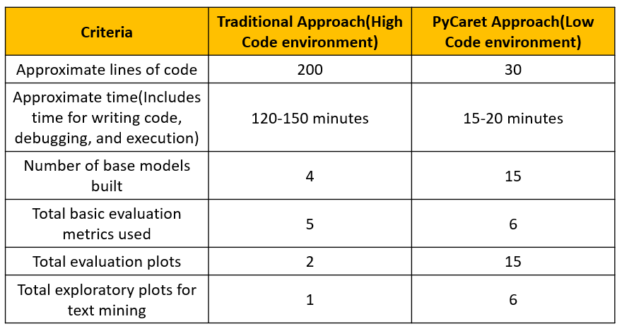

# Natural Language Processing Text Classification : PyCaret Approach Vs The Traditional Approach

- This repository contains a tutorial, `Spam-Ham.ipynb`, that covers solving a *text classification* problem by building machine learning models in python.
- [SMS Spam Collection Data Set](https://archive.ics.uci.edu/ml/datasets/sms+spam+collection) has been taken from UCI Machine Learning Repository for model development. Different approaches and different binary classification models were developed on this dataset to identify if a given text message a `Spam` message or a `Ham` message
- One approach was to use python package [PyCaret](https://pycaret.org/), a low-code ML library, to build and tune machine learning models with minimum lines of code. The other approach was the traditional way of using [scikit-learn](https://scikit-learn.org/stable/) and other phtyhon libraries to solve the same problem. A quick comparison between the two approaches has been recorded in the following table. 
  
- More step-wise details on this code and approach can be found on my [Medium article](https://medium.com/towards-data-science/nlp-classification-in-python-pycaret-approach-vs-the-traditional-approach-602d38d29f06).
